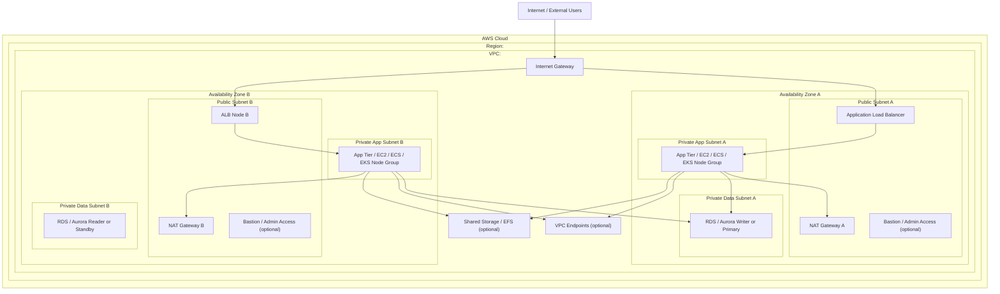

# Baseline AWS Network Blueprint

This is the default blueprint for the first version of the diagram generator.

It is intentionally opinionated:

- one AWS account view
- one region view
- one primary VPC per diagram
- two availability zones when available
- mirrored network tiers
- explicit flow arrows between ingress, compute, and data services

The blueprint is meant to match the style of AWS reference diagrams without overfitting to a single workload.

## Visual Intent

- Clean AWS reference-architecture style
- Official AWS icons in the final rendered version
- Strong infrastructure boundaries
- Minimal line crossing
- Clear top-down or left-to-right flow
- Easy to extend with workload-specific details later
- Clean whitespace between tiers, groups, and flows
- No text overlap with icons, group containers, or traffic lines
- Group membership shown explicitly and only once

## AWS Reference Conventions

The renderer should follow the visual language used in recent AWS reference architectures:

- Use the official AWS Architecture Icons package only.
- Put major explanatory text in a dedicated side panel or callout area instead of overloading the main diagram.
- Use numbered traffic-flow callouts when the path is non-trivial.
- Keep routing tables, attachment tables, or legend blocks outside the main traffic lane unless they are essential to understanding the design.
- Use color consistently by concept, not decoratively. In AWS references, boundaries, connectivity types, and flow types often have stable color meaning.
- Prefer orthogonal routing with connector lanes so the eye can follow traffic without crossing icons.
- Keep icons and labels aligned to a clear grid.

### References

- AWS Architecture Icons: https://aws.amazon.com/architecture/icons/
- Traffic Encryption Options in AWS Direct Connect: https://d1.awsstatic.com/architecture-diagrams/ArchitectureDiagrams/traffic-encryption-options-direct-connect-ra.pdf?did=wp_card&trk=wp_card
- Hybrid connectivity between AWS GovCloud and commercial Regions: https://d1.awsstatic.com/architecture-diagrams/ArchitectureDiagrams/hybrid-connectivity-between-aws-govcloud-and-commercial-regions.pdf?did=wp_card&trk=wp_card
- Active/Active and Active/Passive Configurations in AWS Direct Connect: https://docs.aws.amazon.com/architecture-diagrams/latest/active-active-and-active-passive-configurations-in-aws-direct-connect/active-active-and-active-passive-configurations-in-aws-direct-connect.html?did=wp_card&trk=wp_card

## Default Layout

## Core Blueprint Rules

### Boundaries

Always show:

1. AWS cloud boundary
2. Region boundary
3. VPC boundary
4. Availability zone boundaries
5. Subnet boundaries

### Tiers

Use these tiers in order:

1. Edge and ingress
2. Public networking
3. Private application
4. Private data
5. Shared and external dependencies

### Default Components

These are the default placeholders the renderer should try to populate:

- Internet Gateway
- Application Load Balancer
- NAT Gateway per AZ when egress is required
- Optional bastion or admin entry point
- App tier in each AZ
- Data tier in each AZ when the service is zonal, or one regional database symbol if that reads better
- Shared storage such as EFS when present
- VPC endpoints when they materially affect traffic flow

### Flow Rules

Show these flows by default when the resources exist:

1. Internet to ingress
2. Ingress to application tier
3. Application tier to data tier
4. Application tier to outbound internet through NAT
5. Application tier to AWS-managed dependencies through VPC endpoints where applicable

#### Routing Rules

- Route traffic in reserved lanes between tiers instead of drawing lines through icons.
- Prefer vertical or horizontal orthogonal connectors over diagonal lines.
- Keep traffic lines outside resource boxes where possible, then enter at a single clear edge.
- Do not place arrowheads or labels on top of resource icons.
- If a path would cross a resource or group, reroute it around the boundary.
- Support distinct connector styles when the flow type differs, for example VPN versus Direct Connect or control-plane versus data-plane.
- For complex flows, allow numbered step markers that map to a side legend.

#### Label Rules

- Center subnet and AZ labels in dedicated whitespace, not on top of resources.
- Keep resource names below or beside the icon with consistent spacing.
- Split long labels across two lines before reducing font size.
- Group labels should sit inside the group boundary without colliding with members.
- Keep route tables, legends, and explanatory panels in reserved side or lower regions instead of inside the core workload area.

### Omit by Default

Do not render every low-value object in the first view.

Hide unless specifically requested or needed for clarity:

- every route table
- every NACL
- every ENI
- every security group rule
- every target group detail
- every replica if it makes the diagram unreadable

## How This Maps To Discovery

The discovery layer should normalize AWS resources into:

- boundaries
- tiers
- nodes
- edges
- annotations
- groups

### Group Semantics

Resources that belong to a specific grouping construct should be rendered inside that grouping construct and not duplicated outside it.

Examples:

- Auto Scaling group members render inside their Auto Scaling group boundary
- Security-group-specific resources render inside the security group container when that grouping is enabled for the view
- Cluster members render inside the cluster boundary
- If a resource belongs to multiple logical groups, pick the primary visual owner and represent secondary membership as metadata or annotations, not duplicate icons

That normalized graph is what the renderer should consume.

## Why This Is The Right Starting Point

- It matches common AWS reference-diagram structure.
- It gives us a stable layout before implementing account discovery.
- It is broad enough to support EC2, ECS, EKS, and mixed-service workloads.
- It makes network flow the primary visual story, which matches the project goal.
